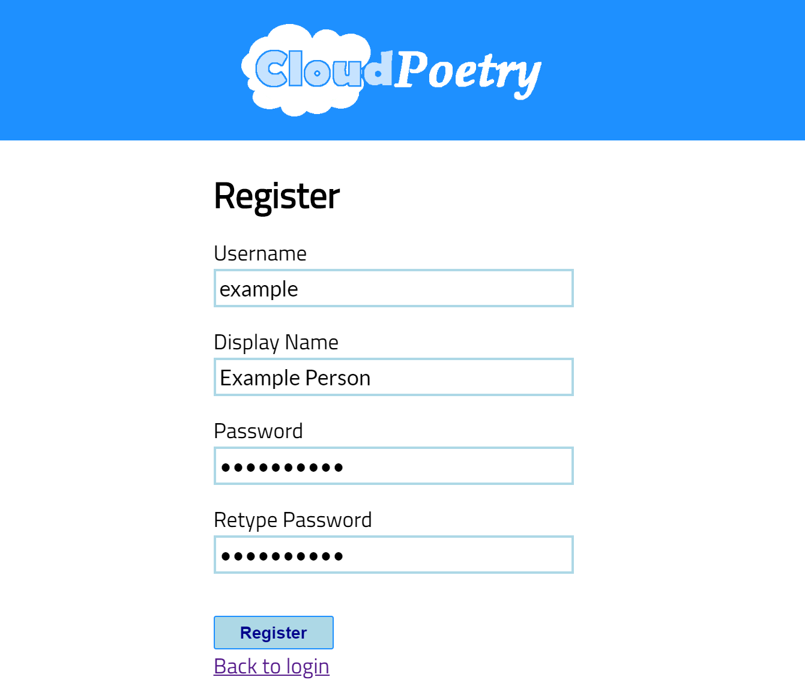
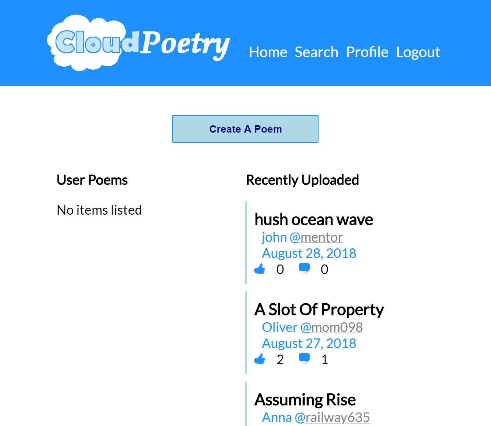
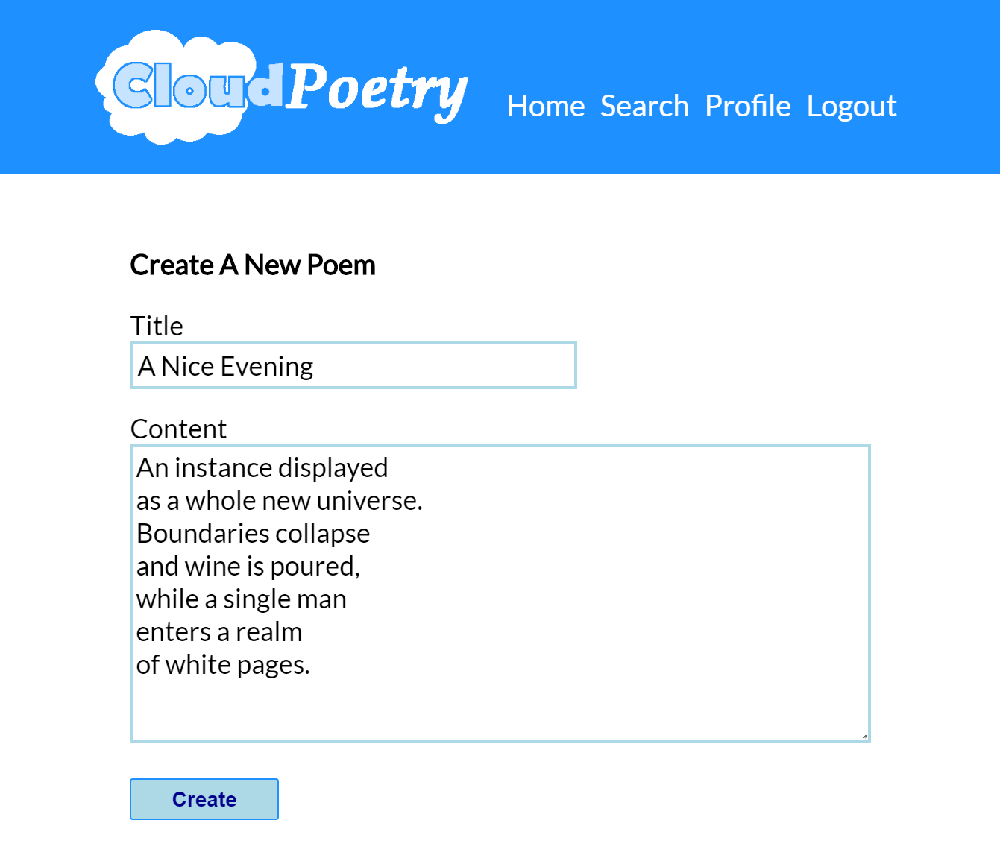
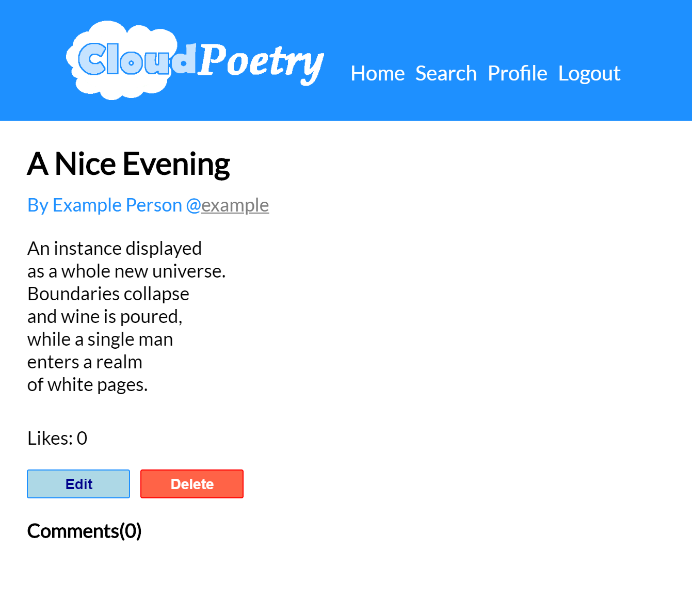

## Cloud Poetry

Cloud Poetry is an app designed to create and find new user-made poems. To get started, all you have to do is create a new profile and log in.

## Home Page

Once you reach the home page, you can either start by browsing recently written poems, search using a keyword, or create your own. Creating is as easy as clicking the 'Create New Poem' button and submitting.

## Poem Display Page

Once you have created your poem, you can follow it's link to the display page, which shows the complete text, along with options to edit, delete and comment. If you are viewing someone elses poem, you also have the option of liking their poem. Past likes can be found through the profile page.